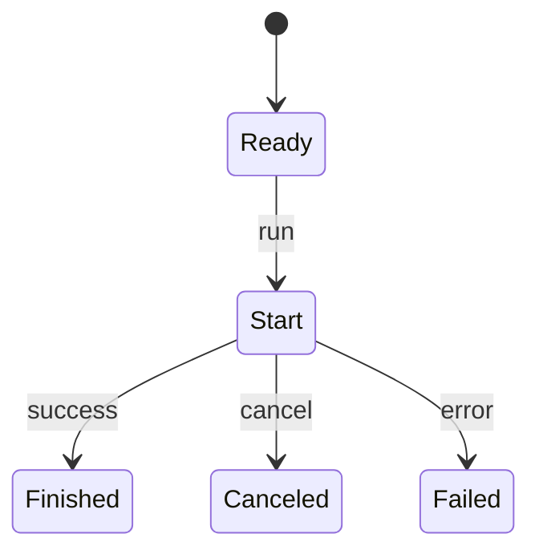
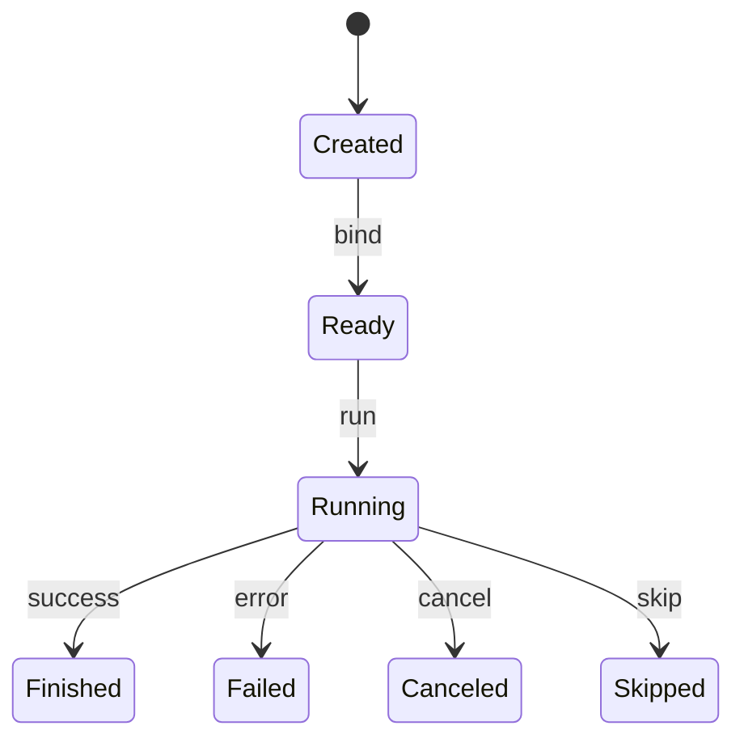

# FSM

## Job

```mermaid
stateDiagram-v2
    [*] --> Ready
    Ready --> Start: run
    Start --> Finished: success
    Start --> Canceled: cancel
    Start --> Failed: error
```

## Step

```mermaid
stateDiagram-v2
    [*] --> Created
    Created --> Ready: bind
    Ready --> Running: run
    Running --> Finished: success
    Running --> Failed: error
    Running --> Canceled: cancel
    Running --> Skipped: skip
```
